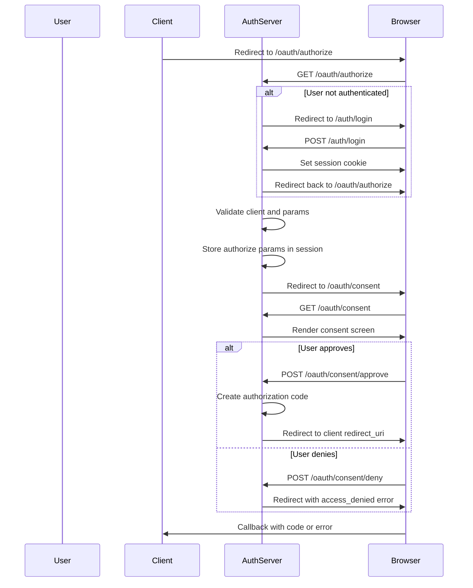
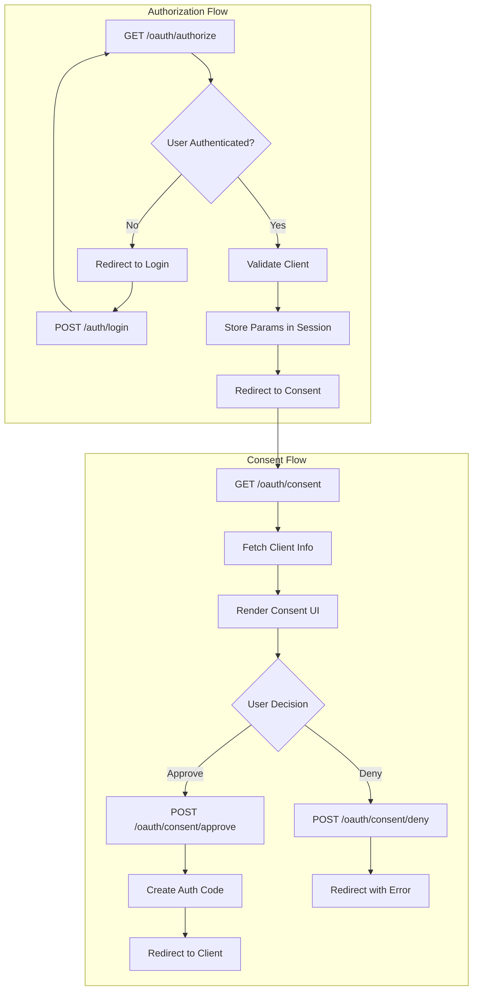

# OAuth Consent Flow Design Document

## Executive Summary

This document outlines the design for implementing a proper OAuth 2.0 consent flow in the authorization server. The current implementation has consent routes defined but they are disconnected from the authorization flow, which auto-approves all requests.

---

## 1. Current Implementation Analysis

### 1.1 OAuth Routes (`app/oauth/routes.py`)

The current authorization endpoint has the following issues:

| Route | Method | Current Behavior | Issue |
|-------|--------|------------------|-------|
| `/oauth/authorize` | GET | Auto-approves without consent | Skips consent screen entirely |
| `/oauth/consent` | GET | Returns params from session | Session params never set by authorize |
| `/oauth/consent/approve` | POST | Creates code from session params | Not integrated with authorize flow |
| `/oauth/consent/deny` | POST | Returns access_denied error | Not integrated with authorize flow |
| `/oauth/token` | POST | Exchanges code for token | Missing client authentication |

**Key Code Issue (lines 36-37):**
```python
# Show consent screen (skipped here, could be a template)
# For now we assume consent is granted automatically
```

### 1.2 OAuth Service (`app/oauth/service.py`)

The service layer has the following gaps:

- [`create_authorization_code()`](app/oauth/service.py:14) - Missing `redirect_uri` and `scope` parameters
- [`exchange_code_for_token()`](app/oauth/service.py:34) - Missing client validation and redirect_uri verification

### 1.3 OAuth Models (`app/oauth/models.py`)

Current models:

| Model | Fields | Missing |
|-------|--------|---------|
| `OAuthClient` | id, client_id, client_secret, redirect_uri, created_at | name, scopes, logo_uri |
| `AuthorizationCode` | id, code, user_id, client_id, expires_at, created_at | redirect_uri, scope, nonce |

### 1.4 Session Management

Current session usage:
- `user_id` - Set by login, used for authentication
- `authorize_params` - Defined but never populated

---

## 2. Proposed Consent Flow Architecture

### 2.1 Flow Diagram



### 2.2 Component Architecture



---

## 3. Required Changes

### 3.1 Model Changes

#### OAuthClient Model Enhancements

```python
# Add to app/oauth/models.py
class OAuthClient(Base):
    __tablename__ = "oauth_clients"
    
    # Existing fields
    id = Column(UUID(as_uuid=True), primary_key=True, default=uuid.uuid4)
    client_id = Column(String, unique=True, nullable=False)
    client_secret = Column(String, nullable=False)
    redirect_uri = Column(Text, nullable=False)
    created_at = Column(DateTime, default=datetime.utcnow)
    
    # New fields
    name = Column(String, nullable=False)  # Display name for consent screen
    logo_uri = Column(Text, nullable=True)  # Optional logo URL
    scopes = Column(Text, nullable=False)  # Comma-separated allowed scopes
    tos_uri = Column(Text, nullable=True)  # Terms of service URI
    policy_uri = Column(Text, nullable=True)  # Privacy policy URI
```

#### AuthorizationCode Model Enhancements

```python
# Update in app/oauth/models.py
class AuthorizationCode(Base):
    __tablename__ = "authorization_codes"
    
    # Existing fields
    id = Column(UUID(as_uuid=True), primary_key=True, default=uuid.uuid4)
    code = Column(String, unique=True, nullable=False)
    user_id = Column(UUID(as_uuid=True), nullable=False)
    client_id = Column(String, nullable=False)
    expires_at = Column(DateTime, nullable=False)
    created_at = Column(DateTime, default=datetime.utcnow)
    
    # New fields
    redirect_uri = Column(Text, nullable=False)  # For validation at token exchange
    scope = Column(Text, nullable=False)  # Granted scopes
    nonce = Column(Text, nullable=True)  # For OIDC id_token
```

### 3.2 Service Layer Changes

#### Updated `create_authorization_code` Function

```python
def create_authorization_code(
    db: Session,
    user_id: str,
    client_id: str,
    redirect_uri: str,
    scope: str,
    nonce: Optional[str] = None,
) -> str:
    code = secrets.token_urlsafe(32)
    
    auth_code = AuthorizationCode(
        code=code,
        user_id=user_id,
        client_id=client_id,
        redirect_uri=redirect_uri,
        scope=scope,
        nonce=nonce,
        expires_at=datetime.utcnow() + timedelta(seconds=CODE_EXPIRY_SECONDS),
    )
    
    db.add(auth_code)
    db.commit()
    
    return code
```

#### New Client Validation Function

```python
def validate_client(
    db: Session,
    client_id: str,
    redirect_uri: str,
    requested_scopes: str,
) -> OAuthClient:
    """
    Validate OAuth client and its parameters.
    
    Raises OAuthError if validation fails.
    """
    client = db.query(OAuthClient).filter(
        OAuthClient.client_id == client_id
    ).first()
    
    if not client:
        raise OAuthError(
            error_code=OAuthErrorCode.UNAUTHORIZED_CLIENT,
            description="Unknown client"
        )
    
    if redirect_uri != client.redirect_uri:
        raise OAuthError(
            error_code=OAuthErrorCode.INVALID_REQUEST,
            description="Redirect URI mismatch"
        )
    
    # Validate requested scopes are subset of allowed scopes
    allowed_scopes = set(client.scopes.split())
    requested = set(requested_scopes.split())
    
    if not requested.issubset(allowed_scopes):
        raise OAuthError(
            error_code=OAuthErrorCode.INVALID_SCOPE,
            description=f"Requested scopes not allowed: {requested - allowed_scopes}"
        )
    
    return client
```

### 3.3 Route Changes

#### Updated Authorization Endpoint

```python
@router.get("/authorize")
def authorize(
    request: Request,
    client_id: str,
    redirect_uri: str,
    response_type: str,
    scope: str,
    state: str,
    nonce: Optional[str] = None,  # For OIDC
    db: Session = Depends(get_db),
):
    # Validate response type
    if response_type != "code":
        return create_authorization_error_response(
            redirect_uri=redirect_uri,
            error_code=OAuthErrorCode.UNSUPPORTED_RESPONSE_TYPE,
            description="Only 'code' response type is supported",
            state=state
        )
    
    # Validate client and parameters
    try:
        client = validate_client(db, client_id, redirect_uri, scope)
    except OAuthError as e:
        return create_authorization_error_response(
            redirect_uri=redirect_uri,
            error_code=e.error_code,
            description=e.description,
            state=state
        )
    
    # Check user authentication
    user = get_current_user(request, db)
    if not user:
        # Store params in session for post-login redirect
        request.session["authorize_params"] = {
            "client_id": client_id,
            "redirect_uri": redirect_uri,
            "response_type": response_type,
            "scope": scope,
            "state": state,
            "nonce": nonce,
        }
        login_url = f"/auth/login?next=/oauth/authorize"
        return RedirectResponse(login_url)
    
    # Store params in session for consent flow
    request.session["authorize_params"] = {
        "client_id": client_id,
        "redirect_uri": redirect_uri,
        "response_type": response_type,
        "scope": scope,
        "state": state,
        "nonce": nonce,
    }
    
    # Redirect to consent screen
    return RedirectResponse("/oauth/consent")
```

#### Updated Consent Endpoints

```python
@router.get("/consent", response_class=HTMLResponse)
def consent_page(
    request: Request,
    db: Session = Depends(get_db),
):
    params = request.session.get("authorize_params")
    
    if not params:
        raise HTTPException(400, "Missing authorization request")
    
    user = get_current_user(request, db)
    if not user:
        return RedirectResponse("/auth/login")
    
    # Get client info for display
    client = db.query(OAuthClient).filter(
        OAuthClient.client_id == params["client_id"]
    ).first()
    
    if not client:
        raise HTTPException(400, "Invalid client")
    
    # Parse scopes for display
    scopes = params["scope"].split()
    scope_descriptions = get_scope_descriptions(scopes)
    
    return render_consent_html(user, client, scope_descriptions, params)


@router.post("/consent/approve")
def approve_consent(
    request: Request,
    db: Session = Depends(get_db),
):
    params = request.session.get("authorize_params")
    user = get_current_user(request, db)
    
    if not params or not user:
        raise HTTPException(400, "Session expired or invalid")
    
    code = create_authorization_code(
        db=db,
        user_id=str(user.id),
        client_id=params["client_id"],
        redirect_uri=params["redirect_uri"],
        scope=params["scope"],
        nonce=params.get("nonce"),
    )
    
    # Clear session params
    request.session.pop("authorize_params", None)
    
    redirect_url = (
        f"{params['redirect_uri']}?code={code}&state={params['state']}"
    )
    
    return RedirectResponse(redirect_url)


@router.post("/consent/deny")
def deny_consent(request: Request):
    params = request.session.get("authorize_params")
    
    if not params:
        raise HTTPException(400, "Missing authorization request")
    
    request.session.pop("authorize_params", None)
    
    return create_authorization_error_response(
        redirect_uri=params["redirect_uri"],
        error_code=OAuthErrorCode.ACCESS_DENIED,
        description="The user denied the authorization request",
        state=params.get("state")
    )
```

---

## 4. Consent Screen UI Requirements

### 4.1 Information to Display

The consent screen MUST display:

| Element | Description | Source |
|---------|-------------|--------|
| Client Name | Application name requesting access | `OAuthClient.name` |
| Client Logo | Optional application logo | `OAuthClient.logo_uri` |
| User Identity | Email or username of logged-in user | Session |
| Requested Scopes | List of permissions being requested | `scope` parameter |
| Scope Descriptions | Human-readable descriptions of each scope | Hardcoded/config |
| Cancel/Deny Button | Option to reject authorization | UI element |
| Allow/Approve Button | Option to grant authorization | UI element |

### 4.2 Scope Definitions

```python
# app/oauth/scopes.py
SCOPE_DESCRIPTIONS = {
    "openid": "Authenticate your identity",
    "profile": "Access your profile information (name, picture)",
    "email": "Access your email address",
    "offline_access": "Access your data even when you're offline",
}
```

### 4.3 HTML Template Structure

```html
<!DOCTYPE html>
<html>
<head>
    <title>Authorization Request</title>
</head>
<body>
    <div class="consent-container">
        <div class="client-info">
            
            <h2>{{ client.name }}</h2>
            <p>is requesting access to your account</p>
        </div>
        
        <div class="user-info">
            <p>Signed in as: {{ user.email }}</p>
        </div>
        
        <div class="scopes">
            <h3>This application would like to:</h3>
            <ul>
                
                <li>{{ scope.description }}</li>
                
            </ul>
        </div>
        
        <div class="actions">
            <form method="post" action="/oauth/consent/deny">
                <button type="submit">Deny</button>
            </form>
            <form method="post" action="/oauth/consent/approve">
                <button type="submit">Allow</button>
            </form>
        </div>
        
        <div class="footer">
            <a href="{{ client.tos_uri }}">Terms of Service</a>
            <a href="{{ client.policy_uri }}">Privacy Policy</a>
        </div>
    </div>
</body>
</html>
```

---

## 5. Security Considerations

### 5.1 CSRF Protection

- **State Parameter**: Already implemented, must be preserved through consent flow
- **Session Validation**: Verify session belongs to authenticated user
- **Form CSRF Token**: Add CSRF token to consent forms

### 5.2 Session Security

```python
# Recommendations for session handling
SESSION_CONFIG = {
    "same_site": "lax",  # Prevent CSRF
    "https_only": True,  # Production only
    "session_expiry": 300,  # 5 minutes for consent flow
}
```

### 5.3 Redirect URI Validation

- Exact match validation against registered `redirect_uri`
- No wildcard or regex matching (security best practice)
- Validate at both authorization and token endpoints

### 5.4 Code Security

- Use cryptographically secure random codes (`secrets.token_urlsafe`)
- Short expiration time (600 seconds currently, appropriate)
- Single-use codes (deleted after token exchange)
- Bind code to client_id and redirect_uri

### 5.5 Rate Limiting

Consider implementing rate limiting on:
- Authorization endpoint (per IP, per client)
- Token endpoint (per client)
- Consent endpoints (per session)

---

## 6. Implementation Checklist

### Phase 1: Model Updates
- [ ] Add new fields to `OAuthClient` model
- [ ] Add new fields to `AuthorizationCode` model
- [ ] Create database migration script
- [ ] Update `create_oauth_clients.py` script for new fields

### Phase 2: Service Layer
- [ ] Implement `validate_client()` function
- [ ] Update `create_authorization_code()` with new parameters
- [ ] Update `exchange_code_for_token()` with redirect_uri validation
- [ ] Create `get_scope_descriptions()` helper

### Phase 3: Route Updates
- [ ] Update `/oauth/authorize` to store params and redirect to consent
- [ ] Update `/oauth/consent` GET to render proper UI
- [ ] Update `/oauth/consent/approve` POST with full integration
- [ ] Update `/oauth/consent/deny` POST with proper error response
- [ ] Add CSRF protection to consent forms

### Phase 4: UI Implementation
- [ ] Create consent screen HTML template
- [ ] Add CSS styling for consent screen
- [ ] Implement scope descriptions display
- [ ] Add client logo display

### Phase 5: Testing
- [ ] Unit tests for `validate_client()`
- [ ] Integration tests for full consent flow
- [ ] Test denial path
- [ ] Test session expiry handling
- [ ] Test with invalid client
- [ ] Test with invalid redirect_uri
- [ ] Test with invalid scopes

---

## 7. API Reference

### Authorization Endpoint

```
GET /oauth/authorize
```

**Parameters:**
| Name | Required | Description |
|------|----------|-------------|
| client_id | Yes | Client identifier |
| redirect_uri | Yes | Must match registered URI |
| response_type | Yes | Must be "code" |
| scope | Yes | Space-separated scopes |
| state | Yes | CSRF protection token |
| nonce | No | OIDC nonce value |

### Consent Endpoints

```
GET /oauth/consent
```
Returns consent screen HTML.

```
POST /oauth/consent/approve
```
Creates authorization code and redirects to client.

```
POST /oauth/consent/deny
```
Returns error redirect to client.

### Token Endpoint

```
POST /oauth/token
```

**Parameters:**
| Name | Required | Description |
|------|----------|-------------|
| grant_type | Yes | Must be "authorization_code" |
| code | Yes | Authorization code |
| redirect_uri | Yes | Must match original request |
| client_id | Yes | Client identifier |
| client_secret | Yes | Client secret |

---

## 8. References

- [RFC 6749 - OAuth 2.0 Authorization Framework](https://datatracker.ietf.org/doc/html/rfc6749)
- [RFC 6749 Section 4.1 - Authorization Code Flow](https://datatracker.ietf.org/doc/html/rfc6749#section-4.1)
- [OAuth 2.0 Security Best Current Practice](https://datatracker.ietf.org/doc/html/draft-ietf-oauth-security-topics)
- [OpenID Connect Core 1.0](https://openid.net/specs/openid-connect-core-1_0.html)
