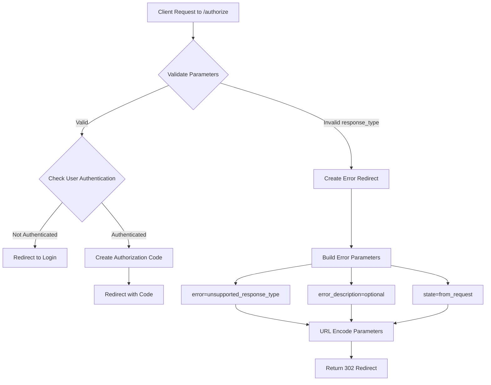

# OAuth 2.0 RFC 6749 Error Response Handling

## Overview

This plan outlines the implementation of RFC 6749 compliant error response handling for the OAuth 2.0 authorization server. The implementation will support both authorization endpoint errors (redirect-based) and token endpoint errors (JSON-based).

## RFC 6749 Error Response Types

### 1. Authorization Endpoint Errors (Section 4.1.2.1)

When an error occurs at the authorization endpoint, the server MUST redirect the user-agent back to the client's redirect URI with the following parameters:

| Parameter | Required | Description |
|-----------|----------|-------------|
| `error` | Yes | Single ASCII error code from the list below |
| `error_description` | No | Human-readable ASCII text providing additional information |
| `error_uri` | No | URI pointing to a page with information about the error |
| `state` | If present in request | The exact value received from the client |

**Standard Error Codes:**
- `invalid_request` - The request is missing a required parameter, includes an invalid parameter value, or is otherwise malformed.
- `unauthorized_client` - The client is not authorized to request an authorization code using this method.
- `access_denied` - The resource owner or authorization server denied the request.
- `unsupported_response_type` - The authorization server does not support obtaining an authorization code using this method.
- `invalid_scope` - The requested scope is invalid, unknown, or malformed.
- `server_error` - The authorization server encountered an unexpected condition.
- `temporarily_unavailable` - The authorization server is temporarily unavailable.

**Example Error Redirect:**
```
HTTP/1.1 302 Found
Location: https://client.example.com/cb?error=unsupported_response_type&error_description=The%20authorization%20server%20does%20not%20support%20this%20response%20type&state=xyz
```

### 2. Token Endpoint Errors (Section 5.2)

When an error occurs at the token endpoint, the server MUST respond with HTTP 400 Bad Request and a JSON body:

| Parameter | Required | Description |
|-----------|----------|-------------|
| `error` | Yes | Single ASCII error code from the list below |
| `error_description` | No | Human-readable ASCII text providing additional information |
| `error_uri` | No | URI pointing to a page with information about the error |

**Standard Error Codes:**
- `invalid_request` - The request is missing a required parameter or is otherwise malformed.
- `invalid_client` - Client authentication failed.
- `invalid_grant` - The provided authorization grant or refresh token is invalid, expired, revoked, or does not match the redirection URI.
- `unauthorized_client` - The authenticated client is not authorized to use this authorization grant type.
- `unsupported_grant_type` - The authorization grant type is not supported by the authorization server.
- `invalid_scope` - The requested scope is invalid, unknown, or malformed.

**Example Error Response:**
```json
HTTP/1.1 400 Bad Request
Content-Type: application/json;charset=UTF-8
Cache-Control: no-store
Pragma: no-cache

{
  "error": "invalid_request",
  "error_description": "The request is missing a required parameter: code"
}
```

## Implementation Design

### File Structure

```
app/oauth/
├── errors.py          # New file: Error types and response utilities
├── models.py          # Existing: OAuth models
├── routes.py          # Modified: Use new error handling
├── service.py         # Existing: OAuth services
└── utils.py           # Existing: Utility functions
```

### Components

#### 1. Error Types Enum

```python
# app/oauth/errors.py

from enum import Enum

class OAuthErrorCode(str, Enum):
    # Authorization endpoint errors
    INVALID_REQUEST = "invalid_request"
    UNAUTHORIZED_CLIENT = "unauthorized_client"
    ACCESS_DENIED = "access_denied"
    UNSUPPORTED_RESPONSE_TYPE = "unsupported_response_type"
    INVALID_SCOPE = "invalid_scope"
    SERVER_ERROR = "server_error"
    TEMPORARILY_UNAVAILABLE = "temporarily_unavailable"
    
    # Token endpoint errors (additional)
    INVALID_CLIENT = "invalid_client"
    INVALID_GRANT = "invalid_grant"
    UNSUPPORTED_GRANT_TYPE = "unsupported_grant_type"
```

#### 2. OAuth Exception Classes

```python
class OAuthError(Exception):
    """Base OAuth error exception."""
    def __init__(
        self,
        error_code: OAuthErrorCode,
        description: str = None,
        uri: str = None,
        state: str = None
    ):
        self.error_code = error_code
        self.description = description
        self.uri = uri
        self.state = state
        super().__init__(description or error_code.value)
```

#### 3. Authorization Error Response Function

```python
def create_authorization_error_response(
    redirect_uri: str,
    error_code: OAuthErrorCode,
    description: str = None,
    state: str = None
) -> RedirectResponse:
    """
    Create a redirect response with OAuth error parameters.
    
    Args:
        redirect_uri: The client's redirect URI
        error_code: The OAuth error code
        description: Optional human-readable error description
        state: The state parameter from the original request
    
    Returns:
        RedirectResponse with error parameters in the query string
    """
    params = {"error": error_code.value}
    
    if description:
        params["error_description"] = description
    
    if state:
        params["state"] = state
    
    # Build the redirect URL with error parameters
    separator = "&" if "?" in redirect_uri else "?"
    query_string = "&".join(f"{k}={quote(v)}" for k, v in params.items())
    location = f"{redirect_uri}{separator}{query_string}"
    
    return RedirectResponse(location, status_code=302)
```

#### 4. Token Error Response Function

```python
def create_token_error_response(
    error_code: OAuthErrorCode,
    description: str = None,
    uri: str = None
) -> JSONResponse:
    """
    Create a JSON error response for the token endpoint.
    
    Args:
        error_code: The OAuth error code
        description: Optional human-readable error description
        uri: Optional URI for error documentation
    
    Returns:
        JSONResponse with error details and appropriate headers
    """
    content = {"error": error_code.value}
    
    if description:
        content["error_description"] = description
    
    if uri:
        content["error_uri"] = uri
    
    return JSONResponse(
        status_code=400,
        content=content,
        headers={
            "Cache-Control": "no-store",
            "Pragma": "no-cache"
        }
    )
```

### Usage in Authorization Endpoint

**Current Implementation:**
```python
# app/oauth/routes.py (line 22-23)
if response_type != "code":
    raise HTTPException(400, "Unsupported response type")
```

**New Implementation:**
```python
# app/oauth/routes.py
from app.oauth.errors import OAuthErrorCode, create_authorization_error_response

@router.get("/authorize")
def authorize(
    request: Request,
    client_id: str,
    redirect_uri: str,
    response_type: str,
    scope: str,
    state: str,
    db: Session = Depends(get_db),
):
    if response_type != "code":
        return create_authorization_error_response(
            redirect_uri=redirect_uri,
            error_code=OAuthErrorCode.UNSUPPORTED_RESPONSE_TYPE,
            description="The authorization server only supports 'code' response type",
            state=state
        )
    # ... rest of the implementation
```

## Workflow Diagram



## Implementation Checklist

- [ ] Create `app/oauth/errors.py` with:
  - [ ] `OAuthErrorCode` enum
  - [ ] `OAuthError` exception class
  - [ ] `create_authorization_error_response()` function
  - [ ] `create_token_error_response()` function
- [ ] Update `app/oauth/routes.py`:
  - [ ] Import new error handling utilities
  - [ ] Replace HTTPException with proper OAuth error response for unsupported_response_type
- [ ] Add unit tests for error handling functions

## Security Considerations

1. **State Parameter**: Always include the state parameter in error responses if it was provided in the request to prevent CSRF attacks.

2. **Error Description**: Keep descriptions generic to avoid leaking implementation details while still being helpful for legitimate debugging.

3. **Redirect URI Validation**: Before redirecting with an error, validate that the redirect_uri is registered for the client to prevent open redirect vulnerabilities.

## References

- [RFC 6749 Section 4.1.2.1 - Authorization Error Response](https://datatracker.ietf.org/doc/html/rfc6749#section-4.1.2.1)
- [RFC 6749 Section 5.2 - Token Error Response](https://datatracker.ietf.org/doc/html/rfc6749#section-5.2)